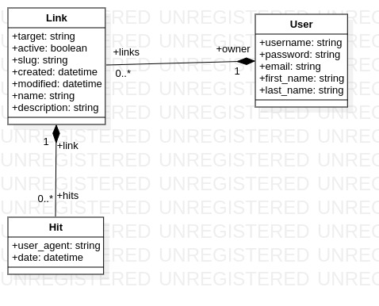

# Processus de Réflexion

*Attention ! Ce fichier n'est pas forcément à jour. Il va me servir de point de départ pour coder ce site. Il ne définit pas l'évolution qu'il pourrait avoir.*

Dans un premier temps je vais définir la fonction de base que notre système devra accomplir.

> Fonction principale *(1)*: Raccourcir les URL.

On va ajouter une fonction secondaire. 

> Fonction secondaire *(2)*: Permettre le comptage du nombre de clics (la sémantique "hit" sera utilisé plus tard)

## Page à réaliser.

SI on n'est PAS authentifié:

- Une page d'accueil (*/*)
- Une page login (*/login*)
- Une page register (*/register*)

SI on est authentifié:

- Une page avec la liste des liens (*/links/*)
- Une page "détails" pour chaque lien (*/links/details*)
- Une page supprimer pour chaque lien (*/links/delete*)
- Une page de création de lien (*/links/create*)
- Une page d'edition de lien (*/links/edit*)

Des pages générales:
- 404 (*empty*)
- 503 (*empty*)
- Une page à propos (*/about*)

## Structure Django

* succinctly
    * base
    * links

## Data Models

Les associations ne seront pas nommées ainsi car django prend en charge une partie des noms.
